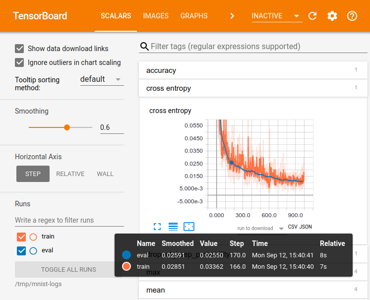

# Tensorflow Object Detection

Object Detection Model Training using Tensorflow.

## Introduction

This tutorial is introduction about Tensorflow Object Detection API.This API can be used to detect , with bounding boxes, objects in image or video using some of the pre-trained models.Using this pre-trained model you can train you image for a custom object detection.

## Requirements

• Windows/Ubuntu     
• CPU or GPU (Ex:NVIDIA-CUDA-Enable GeForce)      
• Tensorflow-CPU/GPU Version         
• Python v2.7 or Python > v3.0        
• OpenCV > v4.0        

## Dependencies

To begin, you have to make sure that all the dependencies should be install on your system.

For CPU :

Install tensorflow on your CPU system using below command.

		pip install tensorflow

For GPU:
Install tensorflow-gpu on your GPU system using below command.         
	
		Pip install tensorflow-gpu

follow below link to install tensorflow properly in your respective OS version on system.             

		 https://www.tensorflow.org/install/

Beyond this , install other python dependencies.

		Pip install pillow
		pip install lxml
		pip install jupyter
		pip install numpy
		pip install pandas
		pip install matplotlib

Repository:

You have to clone or just download the repository tensorflow/model.

		git clone https://github.com/tensorflow/models

or download the .zip and extract.

On Ubuntu :
Navigate to the directory in your terminal and run below command.        

		protoc object_detection/protos/*.proto –python_out=.

And      

		export PYTHONPATH=$PYTHONPATH:`pwd`:`pwd`/slim

Check the version if you get an error on the protoc command if it is not the latest version , you might to update this.

On windows:
Navigate to the        

		https://github.com/protocolbuffers/protobuf/releases

and download protoc-3.4.0-win32.zip version and extract it and you will find protoc.exe in the bin directory.    

Now, from the models directory , you can use protoc command.      

		“C:/Program Files/protoc/bin/protoc” 
		object_detection/protos/*.proto –python_out=.

## Stages to train a model:   

		1.Data Collection.
		2.Annoation.
		3.Train-Test Data.
		4.Generate TF Records files.
		5.Model Architecture.
		6.Train.
		7.Frozen model generation.
		8.Inference.

## 1. Data Collection:         

Collect a few hundred images that contain custom object.
( collect the data as much as possible)
Collect the data with various possible case (eg: captured with different angle based on your use case,with various distance from the object.)
Filter the data ( remove blur image ,unnecessary non frontal images)

## 2. Annotation or labeling

I will recommend LabelImg (https://github.com/tzutalin/labelImg) is graphical image annotation tool.It is written in python and use Qt for it’s graphical interface.This is basically drawing boxes around your object.The label program will create an xml file that contains object information in image ie. object path ,object name , object co-ordinates ( Xmin,Ymin,Xmax and Ymax ) in the image.You can save your xml file in Pascal VOC format used by Imagenet or YoLo format.

I.Install dependencies and run the script from cloned directory.           

	Sudo apt-get install pyqt5-dev-tools
	sudo pip3 install lxml
	make qt5py3
	Python labelImg.py

Labelling :      
i) Click and set directory for input image path and generated output .xml file path.
ii)Draw a rectangle box on the image
iii) click on save with Pascal voc formate and then next to get next image.    

## 3.Train and test set

Make k-fold of your all data to train and test set.
Copy 10% (or 30%) of total data and their annotation to the /test folder and remaining 90% (or 70%) of total data and their annotation to /train folder.     

Generate CSV files:      

 Now you have 2 more directory train and test.You have to convert xml file of these directory to respective .csv files that can be then convert to TFRecord files.     

Run the beow xml_to_csv.py file after setting train/test folder path of xmls.This will generate respective csv files.     

		Python xml_to_csv.py

## 4.Generate TFRecord

Clone tensorflow object detection model API.    

Clone the following repository to your workspace.     

		git clone https://github.com/tensorflow/models.git

Install below dependencies.    

		Sudo apt-get install protobuf-compiler python-pil python-lxml
		sudo pip install jupyer 
		sudo pip install matplotlib

then from tensorflow/models/ directory run below command.    

		protoc object_detection/protos/*.proto --python_out=.

And from tensorflow/model/ directory , run     

		export PYTHONPATH=$PYTHONPATH:`pwd`:`pwd`/slim

Now install object detection library by doing the following from model directory.     

		Sudo python3 setup.py install

Get the generate_tfrecord.py file from the tensorflow/model directory.You need to change class_text_to_int function to your specific class and path of train/test image directory.    

From tensorflow/models/ directory run below command to generate train and test tfRecord files.     
		
		python generate_tfrecord.py --csv_input=data/train_labels.csv  --output_path=train.record

  and 
  
		python generate_tfrecord.py --csv_input=data/test_labels.csv  --output_path=test.record

  
In your /data directory , you should have train.record and test.record.   

## Training the model:

We will train our object detection model to detect our custom object.To do this we need the images , matching tfRecord for training and testing data.    

You have to select an pre-tranied model to re-train on your dataset.As you have some certain number of data.You have to apply transfer learning to train your data on top of pre-trained model.      

The benefit of transfer learning is that training can be much quicker.      

Pre-trained model selection should be based on model accuracy and inference time on some set of standard dataset.        

Now we need to setup the configuration of model, then we can train.           

Tensorflow has quite a few pre-trained model with checkpoint files available, along with configuration files.       

Check below url for pre-trained model config files:        

		https://github.com/tensorflow/models/tree/master/research/object_detection/samples/configs

Here select your pre-trained model checkpoints:         

		https://github.com/tensorflow/models/blob/master/research/object_detection/g3doc/detection_model_zoo.md

You can put all data, train.record,test.record and pre-trained_model_config file in one directory and provide the path as command line to train the model.        

If you get a memory error , you can try to decrease the batch size to get the model to fit in your VRAM.
You also need to change the checkpoint name and path.num_class , num_example to 12 and label_map_path.      

Example :      
Suppose you choose “ssd_mobilenet_v2_coco_2018_03_29” in the models/onject_detection directory.
In the configuration file, you need to search for all above parameter and change them.

Here is your complete configuration file:       

		# SSD with Mobilenet v1, configured for the mac-n-cheese dataset.
		# Users should configure the fine_tune_checkpoint field in the train config as
		# well as the label_map_path and input_path fields in the train_input_reader and
		# eval_input_reader. Search for "${YOUR_GCS_BUCKET}" to find the fields that
		# should be configured.

		model {
		  ssd {
		    num_classes: 1
		    box_coder {
		      faster_rcnn_box_coder {
			y_scale: 10.0
			x_scale: 10.0
			height_scale: 5.0
			width_scale: 5.0
		      }
		    }
		    matcher {
		      argmax_matcher {
			matched_threshold: 0.5
			unmatched_threshold: 0.5
			ignore_thresholds: false
			negatives_lower_than_unmatched: true
			force_match_for_each_row: true
		      }
		    }
		    similarity_calculator {
		      iou_similarity {
		      }
		    }
		    anchor_generator {
		      ssd_anchor_generator {
			num_layers: 6
			min_scale: 0.2
			max_scale: 0.95
			aspect_ratios: 1.0
			aspect_ratios: 2.0
			aspect_ratios: 0.5
			aspect_ratios: 3.0
			aspect_ratios: 0.3333
		      }
		    }
		    image_resizer {
		      fixed_shape_resizer {
			height: 300
			width: 300
		      }
		    }
		    box_predictor {
		      convolutional_box_predictor {
			min_depth: 0
			max_depth: 0
			num_layers_before_predictor: 0
			use_dropout: false
			dropout_keep_probability: 0.8
			kernel_size: 1
			box_code_size: 4
			apply_sigmoid_to_scores: false
			conv_hyperparams {
			  activation: RELU_6,
			  regularizer {
			    l2_regularizer {
			      weight: 0.00004
			    }
			  }
			  initializer {
			    truncated_normal_initializer {
			      stddev: 0.03
			      mean: 0.0
			    }
			  }
			  batch_norm {
			    train: true,
			    scale: true,
			    center: true,
			    decay: 0.9997,
			    epsilon: 0.001,
			  }
			}
		      }
		    }
		    feature_extractor {
		      type: 'ssd_mobilenet_v1'
		      min_depth: 16
		      depth_multiplier: 1.0
		      conv_hyperparams {
			activation: RELU_6,
			regularizer {
			  l2_regularizer {
			    weight: 0.00004
			  }
			}
			initializer {
			  truncated_normal_initializer {
			    stddev: 0.03
			    mean: 0.0
			  }
			}
			batch_norm {
			  train: true,
			  scale: true,
			  center: true,
			  decay: 0.9997,
			  epsilon: 0.001,
			}
		      }
		    }
		    loss {
		      classification_loss {
			weighted_sigmoid {
			  anchorwise_output: true
			}
		      }
		      localization_loss {
			weighted_smooth_l1 {
			  anchorwise_output: true
			}
		      }
		      hard_example_miner {
			num_hard_examples: 3000
			iou_threshold: 0.99
			loss_type: CLASSIFICATION
			max_negatives_per_positive: 3
			min_negatives_per_image: 0
		      }
		      classification_weight: 1.0
		      localization_weight: 1.0
		    }
		    normalize_loss_by_num_matches: true
		    post_processing {
		      batch_non_max_suppression {
			score_threshold: 1e-8
			iou_threshold: 0.6
			max_detections_per_class: 100
			max_total_detections: 100
		      }
		      score_converter: SIGMOID
		    }
		  }
		}

		train_config: {
		  batch_size: 10
		  optimizer {
		    rms_prop_optimizer: {
		      learning_rate: {
			exponential_decay_learning_rate {
			  initial_learning_rate: 0.004
			  decay_steps: 800720
			  decay_factor: 0.95
			}
		      }
		      momentum_optimizer_value: 0.9
		      decay: 0.9
		      epsilon: 1.0
		    }
		  }
		# Path to your pre-trained model.
		  fine_tune_checkpoint: "ssd_mobilenet_v2_coco_2018_03_29/model.ckpt"
		  from_detection_checkpoint: true
		  data_augmentation_options {
		    random_horizontal_flip {
		    }
		  }
		  data_augmentation_options {
		    ssd_random_crop {
		    }
		  }
		}

		train_input_reader: {
		  tf_record_input_reader {
		    input_path: "data/train.record"
		  }
		  label_map_path: "data/object-detection.pbtxt"
		}

		eval_config: {
		  num_examples: 40
		}

		eval_input_reader: {
		  tf_record_input_reader {
		    input_path: "data/test.record"
		  }
		  label_map_path: "training/object-detection.pbtxt"
		  shuffle: false
		  num_readers: 1
		}

You can tune above highlighted parameters accordingly.       

Create a file with name object-detection.pbtxt in your /data directory and add following line:      

		item {
		  id: 1
		  name: 'name_of_your_label'
		}

## Training using Train.py script: 

This is used to train DetectionModels.There are two ways to configuring the training job.      

1. A single pipeline_pb2.TrainEcalPipelineConfig configuration file can be specified by -- pipeline_config_path     

Usages:

		./train –logtostderr –train_dir=path/to/train

2. Three config file can be provided      

I) model_pb2.DetectionModel configuration file --> to define what type of detectionModel is being trained.
II) input_reader_pb2.InputReader file to specify that training data will be used.
III) train_pb2.TrainConfig file to configure training parameter.

From model/research directory run below command:      

			python3 ./object_detection/legacy/train.py --logtostderr –train_dir=../../Unfrozen_model/train/ --pipeline_config_path=../../data/ssd_mobilenet_v2.config

Log Snippet :      

		INFO:tensorflow:global step 11788: loss = 0.6717 (0.398 sec/step)
		INFO:tensorflow:global step 11789: loss = 0.5310 (0.436 sec/step)
		INFO:tensorflow:global step 11790: loss = 0.6614 (0.405 sec/step)
		INFO:tensorflow:global step 11791: loss = 0.7758 (0.460 sec/step)
		INFO:tensorflow:global step 11792: loss = 0.7164 (0.378 sec/step)
		INFO:tensorflow:global step 11793: loss = 0.8096 (0.393 sec/step)

At starting of the training loss value will be very high.       
It depends upon your GPU and data you have taken, this process will take varying amount of time.      
Our trained checkpoint fies should be in the Unfrozen_model/train directory.     

We can check training via Tesorboard visualization tool.     
To run the tensorboard,from models/reseach/object_detection,    

		tensorboard –logdir=’training’

We need to export the graph and then test the model.     

## Testing Custom Object Detector – Tensorflow Object Detection API

We are going to test our trained model.In order to do that we need to export the inference graph.     

In the models/research/object_detection directory, run below command.    

		Python3 export_inference_graph.py –input_type image_tensor
		--pipeline_config_path data/ssd_mobilenet_v1.config --trained_checkpoint_prefix Unfrozen_model/train/inference_graph.ckpt --		output_directory Frozen_model

You have to give pipeline_config_path, trained checkpoints and inference freezed model output directory.     

Note :
If you get an error about mo module name ‘nets’ , then run below command.    

From tensorflow/models/      

		export PYTHONPATH=$PYTHONPATH:`pwd`:`pwd`/slim

or set this path in your environment variable to avoid this error.      

You will get saved a freezed model by name frozen_inference_graph.pb file.      

Testing the trained model:    

Create a test set of images for your testing.
From /model/research/object_detection run below command.      

		Jupyter notebook
		object_detection_tutorial.ipynb

In this ipython notebook you have to change below lines.    
What model to download.    
MODEL_NAME = 'name_of_exported_model'      

Path to frozen detection graph. This is the actual model that is used for the object detection.     
PATH_TO_CKPT = MODEL_NAME + '/frozen_inference_graph.pb'     

List of the strings that is used to add correct label for each box.     
PATH_TO_LABELS = os.path.join('data', 'object-detection.pbtxt')      

NUM_CLASSES = 1 # you number of class of object      
Change the TEST_IMAGE_PATH variable .       

TEST_IMAGE_PATHS = [ os.path.join(PATH_TO_TEST_IMAGES_DIR, 'image{}.jpg'.format(i)) for i in range(1, 8) ]     
 
In above command from TEST_IMAGE directory, takes 8 image to test."Run all" in jupyter notebook.You will get detected bounding box as follows.      

Testing with video or webcam based testing:     

Let’s apply for the testing of streaming video or webcam.     

You have to install opencv library for this and run the script.     

		python3 test.py

